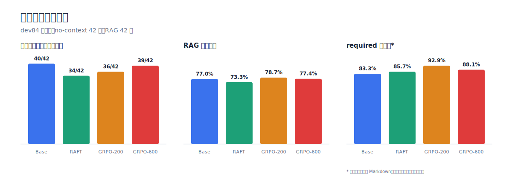
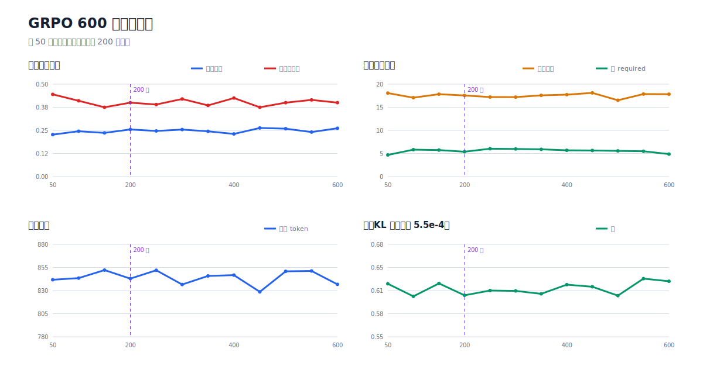
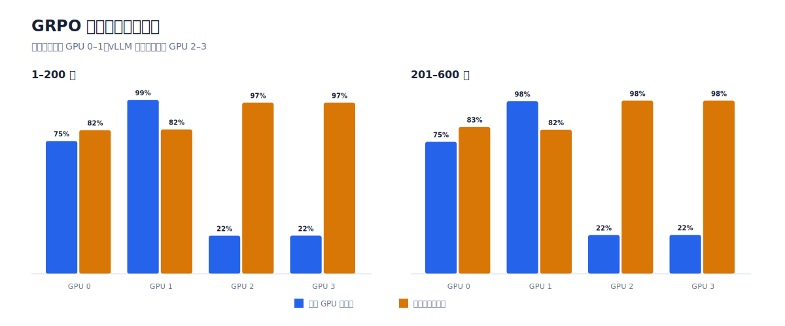

# 中文法律咨询模型的领域适配与评测

对 Qwen3-8B 的一组领域适配实验记录：自由文本法律咨询、有依据的法条引用、结构化信息抽取、量化部署。各阶段的评测协议、门禁阈值与判决规则在训练开始前冻结。

本仓库公开可复核的数据、模型回答正文、统计结果与分析。内部实验编号不作为公开叙事主线；未通过门禁的模型保留为研究 checkpoint，不标记为可部署模型。

## 实验范围

| 项目 | 内容 |
|---|---|
| 底座 | Qwen3-8B Base / Instruct |
| 训练方法 | QLoRA SFT、DPO、RAFT、GRPO |
| 任务 | 法律咨询、法条引用、结构化 Intake |
| 部署 | AWQ W4A16 与 BF16 对照 |
| 评测 | 确定性指标、Legal-50 语义评审、预注册门禁 |
| 训练硬件 | 单卡 RTX 4090D；GRPO 使用 4×RTX 5090 32 GB |

## 主要结果

| 实验 | Base | 训练后 | 判定 |
|---|---:|---:|---|
| Audited Gold SFT：Legal-50 语义均分 | 6.81 | 7.33 | 阶段阳性 |
| 结构化 Intake：confirm120 micro-F1 | 0.6031 | 0.7018 | 局部改善，整体未晋级 |
| 结构化 Intake：金额 F1 | 0.6077 | 0.8936 | 改善 |
| Strict RAFT：no-context 无据引用行 | 40/42 | 34/42 | 改善；dev84 no-context 语义 -0.431，Legal-50 长预算差异不可辨别 |
| GRPO-200：RAG 引用精度 | 0.7703 | 0.7874 | 改善，作为主要引用指标 |
| GRPO-200：冻结抽取器 required 行召回 | 35/42 | 39/42 | 表面形式敏感；4 个表观新增命中里仅 1 行为纯内容新增 |
| GRPO-600：冻结抽取器 required 行召回 | 35/42 | 37/42 | 描述性结果，不解释为纯内容剂量响应 |
| Base-AWQ：并发 1 输出吞吐 | 75.62 tok/s | 194.99 tok/s | 未适配模型的部署基准；非公开 V24-AWQ 权重实测 |

没有任何 RAFT 或 GRPO arm 通过全部预注册门禁。结构化模型也保持 `ARCHIVED_FINAL_FAIL`：金额抽取明显改善，但时间 F1 仅从 `0.6000` 到 `0.6159`，negative 精确率下降。

### 外部模型确定性引用普查

以下回答均在 system prompt 明确要求不要编造具体法条编号的条件下生成。排序依次按高精度无据法名+条号、无据条号、全部无据引用升序。

| 排名 | 模型 | 高精度无据法名+条号 | 无据条号 | 全部无据引用 |
|---:|---|---:|---:|---:|
| 1 | `openai/gpt-5.5` | 0/50 | 0/50 | 0/50 |
| 2 | `anthropic/claude-fable-5` | 0/50 | 0/50 | 2/50 |
| 3 | `anthropic/claude-opus-4.8` | 0/50 | 0/50 | 6/50 |
| 4 | `anthropic/claude-sonnet-5` | 0/50 | 1/50 | 6/50 |
| 5 | `bailian/qwen3.7-max` | 0/50 | 1/50 | 17/50 |
| 6 | `moonshotai/kimi-k2.6` | 0/50 | 2/50 | 19/50 |
| 7 | `google/gemini-2.5-pro` | 0/50 | 2/50 | 25/50 |
| 8 | `z-ai/glm-5.2` | 5/50 | 6/50 | 21/50 |
| 9 | `deepseek/deepseek-v4-pro` | 11/50 | 14/50 | 28/50 |

“无据”只表示引用未由题面提供，不等于法条虚假、失效或适用错误。该表衡量题面 grounding 与指令服从，不替代法源核验。完整回答与边界说明见 [Legal-50](results/legal50.md)。

## 实验阶段

| 阶段 | 内容 | 结果 |
|---|---|---|
| 1 | 建立 Legal-50 语义评测与回答审计规则 | 形成程序级标尺，不作为未见盲测集 |
| 2 | 审计后 Gold SFT | 86 条发布数据（77 训练 / 9 验证）产生项目最明确的早期咨询质量阳性结果 |
| 3 | 引用约束 SFT 与 DPO | SFT 基本不动；高剂量 DPO 能移动行为，但伴随质量漂移 |
| 4 | 结构化法律 Intake | rank 容量消融后提升总体与金额抽取，最终门禁仍未全部通过 |
| 5 | Base-AWQ 部署基准与 V24-AWQ 后验量化 | Base-AWQ 体积与吞吐改善但引用回归；发布的 V24-AWQ 另作结构化 2×2 评测 |
| 6 | RAG 权威上下文与 Strict RAFT | 确定性引用指标改善，语义质量下降 |
| 7 | GRPO 与 200→600 步剂量响应 | 200 步是 RAG 指标高点；增加剂量没有突破奖励结构上限 |

逐阶段结果：

- [Legal-50](results/legal50.md)
- [Audited Gold SFT](results/audited_gold_sft.md)
- [引用约束 SFT 与 DPO](results/instruct_quality.md)
- [结构化法律 Intake](results/structured_intake.md)
- [AWQ 量化与部署](results/quantization.md)
- [RAG、RAFT 与引用行为](results/grounded_citation.md)
- [GRPO 性能与剂量响应](results/grpo.md)
- [评审仪器校准](results/calibration.md)
- [完整优化与劣化案例](results/representative_cases.md)

## 方法观察

### GRPO 的作用范围

GRPO-200 是本组实验中唯一同时提高 RAG 引用精度（`0.7703→0.7874`）、保持整体语义分数地板的方法。冻结抽取器记录的 required 行召回为 `35/42→39/42`，但后验逐行复核发现 4 个表观新增命中里只有 1 行是纯内容新增，另外 3 行受 Markdown、法名与条号间隔或嵌套书名号影响。它没有解决 no-context 切片上的稀疏奖励问题，也没有满足正常停止、重复和引用精度等全部门禁。

200→600 步训练中，KL 稳定在约 `5.5e-4`，entropy 未坍缩；但全败组长期维持约四成，无据错误基本不变。继续增加训练剂量只在已有非零 advantage 的组内重新分配概率，不能从全败组学习。

### 预注册的边界

预注册能够阻止观察结果后的任意改标准，但不能保证从旧实验继承的标准在新适用域中仍然成立。本项目分别在 LoRA rank 假设和风险字段门禁上观察到这一失效模式；完整证据与复验规则见[评审仪器校准](results/calibration.md)。

### LLM 评审的分辨率

成对自评探针的平局率为 `93.75%`，位置翻转率为 `94.09%`。Qwen3-1.7B 质量 RM 在冻结测试集上的 Spearman 为 `0.058`，全部预注册门禁未通过。LLM 评审仍用于宏观排序和灾难性退化检测，但不作为任意精度的奖励真值。

### 运行时控制

训练能够移动平均行为，不能提供零容忍保证。对于无依据法条、输出截断和结构化字段边界，运行时 RAG、引用校验器、schema 校验和解码约束仍是必要组成部分。

## Legal-50 口径

Legal-50 包含 50 道中文情境式法律咨询题，已在历史开发中多次使用。仓库分别保留历史 capped、外部 Strict、内部 uncapped 和长预算复测结果，不合并为单一总榜。

Raw Base 的长预算补测采用 `temperature=0.2, top_p=0.9, max_tokens=8192, seed=20260720`，50/50 正常停止，uncapped 语义均分为 `5.148`。Gold V2 与 Distill V3 的贪心长预算运行出现循环退化，只作为模型与解码协议交互失败的证据。

问题、rubric、回答正文和机器可读统计分别位于：

- [Legal-50 数据](datasets/legal50/)
- [模型回答正文](results/answers/legal50/)
- [协议闭环统计](results/metrics/legal50_protocol_closure.json)
- [外部模型确定性引用统计](results/metrics/legal50_external_citations.json)

## 模型

| 模型 | 形式 | 状态 |
|---|---|---|
| [Qwen3-8B-LegalConsult-Gold](https://huggingface.co/haofue2i1z3/Qwen3-8B-LegalConsult-Gold) | Base LoRA | 阶段阳性 |
| [Qwen3-8B-LegalIntake](https://huggingface.co/haofue2i1z3/Qwen3-8B-LegalIntake) | Instruct LoRA | 未通过全部门禁 |
| [Qwen3-8B-LegalCitation-GRPO-200](https://huggingface.co/haofue2i1z3/Qwen3-8B-LegalCitation-GRPO-200) | Instruct LoRA | 未通过全部门禁 |
| [Qwen3-8B-LegalCitation-GRPO-600](https://huggingface.co/haofue2i1z3/Qwen3-8B-LegalCitation-GRPO-600) | GRPO-200 续训 LoRA | 未通过全部门禁 |
| [Qwen3-8B-Legal-AWQ](https://huggingface.co/haofue2i1z3/Qwen3-8B-Legal-AWQ) | V24 融合后 W4A16 完整权重 | 后验量化资产，未通过全部门禁 |

仓库内同时保留[模型卡副本](model_cards/)，便于在模型托管页面之外复核训练目标、结果和限制。

## 数据与结果

| 目录 | 内容 |
|---|---|
| [`datasets/legal50/`](datasets/legal50/) | 50 道咨询题与评分规则 |
| [`datasets/audited_gold_sft/`](datasets/audited_gold_sft/) | 审计后自由文本 SFT 数据 |
| [`datasets/structured_intake/`](datasets/structured_intake/) | Intake 训练、开发与 confirm120 |
| [`datasets/grounded_citation/`](datasets/grounded_citation/) | RAG 权威上下文、train900 与 dev84 |
| [`datasets/citation_sft_dpo/`](datasets/citation_sft_dpo/) | 引用约束 SFT/DPO 数据与失败实验材料 |
| [`datasets/raft_strict/`](datasets/raft_strict/) | Strict RAFT 选择数据与评分 |
| [`datasets/quality_rm_failed/`](datasets/quality_rm_failed/) | 质量 RM 训练、测试和失败预测 |
| [`results/answers/`](results/answers/) | 未经人工补写的模型回答正文 |
| [`results/metrics/`](results/metrics/) | 机器可读指标、遥测和判决结果 |
| [`dataset_manifest.json`](dataset_manifest.json) | 公开数据文件索引与行数 |
| [`result_manifest.json`](result_manifest.json) | 公开结果文件索引 |

## 限制

- 本项目是实验记录，不提供法律服务；模型审核不等同于执业律师复核。
- Legal-50 是程序级标尺，不是干净盲测集。
- 跨阶段实验共享任务方向，但不总是使用同一冻结题集或同一评分场。
- “无据引用”表示引用未由题面或 RAG 上下文支持，不证明法条虚假、失效或适用错误。
- 外部 Strict、内部 uncapped、历史 capped 与长预算复测结果禁止合并排序。
- 本仓库公开数据、回答、统计结果和分析，不包含服务器运维脚本与临时修复脚本。
- 原创材料与第三方评测资产的许可边界见[许可与来源说明](NOTICE.md)。
