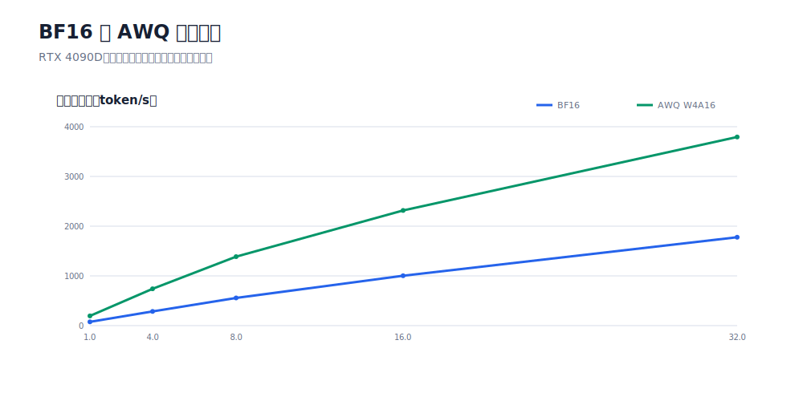

# AWQ 量化与部署

Qwen3-8B Instruct 使用 512 条零评测泄漏领域语料完成 W4A16_ASYM、group size 128 的 AWQ 量化，并在 RTX 4090D、vLLM 0.24.0 下与 BF16 对比。

## 主模式性能

| 并发 | BF16 tok/s | AWQ tok/s | 吞吐变化 | TPOT p95 BF16/AWQ (ms) |
|---:|---:|---:|---:|---:|
| 1 | 75.62 | 194.99 | +157.85% | 16.97 / 6.55 |
| 4 | 285.58 | 740.06 | +159.14% | 17.93 / 6.89 |
| 8 | 555.80 | 1387.01 | +149.55% | 18.41 / 7.34 |
| 16 | 1003.89 | 2315.97 | +130.70% | 19.18 / 8.33 |
| 32 | 1777.38 | 3793.90 | +113.45% | 21.70 / 10.20 |

- checkpoint：16.40 GB → 6.11 GB（-62.74%）。
- KV cache：43,920 → 106,624 tokens（+142.77%）。
- 40/40 次正式运行成功，未发生 preemption。

## 质量回归

| 指标 | BF16 | AWQ | 变化 |
|---|---:|---:|---:|
| dev60 无据引用行 | 38/60 | 49/60 | +11 |
| dev60 重复内容 | 0 | 1 | +1 |
| Assistant-token PPL | 13.5747 | 12.9532 | -4.58% |
| V19 抽取 micro-F1 | 0.6154 | 0.7018 | +8.64pt |

部署性能明确改善，但 `quality_no_regression=false`。AWQ 不是 BF16 的无条件等价替代：自由文本法律咨询必须保留引用约束与确定性校验；结构化接口需要单独验收。

结构化 2x2 后验实验也显示量化会移动抽取边界，而不是单向降低质量。该结果为描述性证据，不改变结构化模型的历史 FAIL。

## 代表性案例

[完整优化与劣化原文](cases/04-quantization-and-raft.md)。
